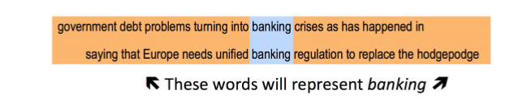
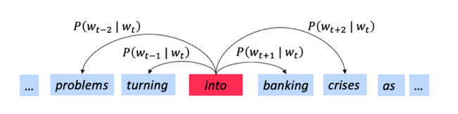
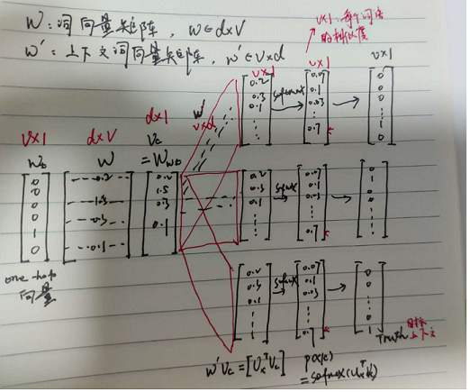
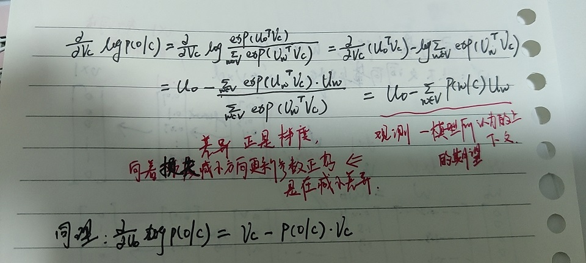

#### 如何表示一个词语的意思 

   - **意义**的定义（meaning）：
     - 人或者文字符号等想要表达的idea
   - 语言学中的意义：
     - 指代

#### 计算机如何表示语义？

   - 字典、词库（比如 WordNet 的词库），可以查询同义词、上位词之类的。

     - 栗子：包含‘good'的同义词集

       ```
       from nltk.corpus import wordnet as wn 
       poses ={'n':'noun','v':'verb','s':'adj(s)','a':'adj','r':'adv'}
       
       for synset in wn.synsets('good'):
           print('{}:{}'.format(poses[synset.pos()],
                                ','.join([l.name() for l in synset.lemmas()])))
                                
       ```
           noun:good
           noun:good,goodness
           ...
           adj:good
           adj(s):estimable,good,honorable,respectable
           adj(s):beneficial,good
           ....
           adv:well,good
           adv:thoroughly,soundly,good
       
     - 栗子：’pandas'的上位词

       ```
        panda = wn.synset('panda.n.01')
        hyper = lambda s:s.hypernyms()
        list(panda.closure(hyper))
       ```
      ```
      [Synset('procyonid.n.01'),
      Synset('carnivore.n.01'), ##肉食动物
      Synset('placental.n.01'), ##胎盘
      ...
      Synset('physical_entity.n.01'),
      Synset('entity.n.01')]
      ```


####  one-hot 离散表示的问题 discrete representation

   - 虽然是语言学的很好的资源，但是丢失了韵味
     - 比如这些同义词之间还是有些细微的、微妙的差别：proficient 与good属同义词，但是只在某些语境下起作用。

   - 缺少新词、俚语

   - 主观

   - 耗费大量的人力

   - 无法计算准确的词语相似度

     - 传统NLP，将单词视作最小的单位离散符号。这是一种局部的表示方式。

     - word表示为一个one-hot向量，语料库中的词汇可能会非常大；并且两个意思相近的词汇没办法计算相似度，因为词向量是正交的。

       ```
       motel = [0,0,0,0,0,1,0]
       hotel = [0,0,0,1,0,0,0]
       ```

   - 	解决方法：分布式语义（指称语义） 

<!-- #region -->
####  分布式语义 

   - 通过一个单词的上下文得到它的意思

   - 如果你能把单词放到正确的上下文中去，才说明你掌握了它的意义。

     

####  词向量

   - 通过调整一个单词及其上下文单词的向量，使得根据两个向量可以推测两个 词语的相似度；或根据向量可以预测词语的上下文。
   - **它会准确的给出在上下文中出现的单词的高概率估计；在上下文不会出现的单词，则得到低概率的估计**。
   - **用一个简单的概率分布，来预测背景中所有的上下文单词**
   - 不同的语境会使用不同的词语，因此，这是一个比较宽松的模型

####  word2vec:学习词向量的一种架构。

   - 基本思想：

     - 在已有的大语料库上，建立词表，词表中的每个单词表示为一个向量（随机向量启动）。
     - 在遍历文本的过程中，每一个当前位置的词称为中心词，中心词周围的称为上下文词 。利用中心词和上下文词的相似性，计算**中心词**在给定**上下文词后**(或者相反)的**概率**。 不断更新词向量使得上述概率最大化。

   - 两种算法：

     - **Skip-grams**：基于 中心词预测上下文词

       - 给定中心词c，上下文o出现的概率可以用$u_{o}$和 $v_{c}$ 的余弦相似性表示，并作归一化处理。
     - **CBOW算法** ：连续词袋算法，上下文词预测中心词

####  **Skip-grams**
   - 目标函数：所有位置的预测结果的乘积

     对每一个位置t=1...T，根据中心词$w_{t}$预测在窗口大小为m的上下文词（$\theta $表示所有需要优化的变量）
     $$ 似然函数=L(\theta )=\prod_{t=1}^{T}\prod_{-m\leq j\leq m,j\neq 0}  p(w_{t+j}|w_{t};\theta) $$
     目标函数$J(\theta)$是似然函数的负对数:最小化目标函数即最大化预测准确率。
      $$ J(\theta )=- \frac{1}{T}log L(\theta ) =- \frac{1}{T} \prod_{t=1}^{T}\prod_{-m\leq j\leq m,j\neq 0}  log p(w_{t+j}|w_{t};\theta) $$


- 计算 $ p(w_{t+j}|w_{t};\theta)$:
    - 每一个词**w 用两个向量**表示 ：
        - 当词w作为中心词，用$v_{w}$表示
        - 当词w作为上下文词，用$u_{w}$表示
    - 对于中心词c 和上下文词o,(o是某个具体的上下文词，U是上下文词向量，V是所词向量)：
        $$p(o|c)=\frac{exp(u_{o}^{T}v_{c})}{\sum_{w\subseteq V}exp(u_{w}^{T}v_{c})} $$
    - 点积：$u^{T}v$
         - 点积可以衡量两个向量相似度，两个向量越相似，其点积越大。
    - 计算$p(w_{t+j}|w_{t})$ 的过程
    
    - 板书
    
    
    - 对于每个词都有2个词嵌入u和v，可以仅使用v，或者将u和v相加，或者拼接在一起构成一个双倍的词嵌入


- 训练模型与最优化：leran W 和 W'
    - 目标函数：
    $$ J(\theta )=- \frac{1}{T}log L(\theta ) =- \frac{1}{T} \prod_{t=1}^{T}\prod_{-m\leq j\leq m,j\neq 0}  log p(w_{t+j}|w_{t};\theta) $$
   where:
    $$p(o|c)=\frac{exp(u_{o}^{T}v_{c})}{\sum_{w\subseteq V}exp(u_{w}^{T}v_{c})} 
    $$
    - 优化算法：梯度下降。
        - 对于当前的$\theta$，计算$J(\theta)$的梯度。对u,v求偏导。
        
        
        - 将$\theta$沿负梯度的方向更新梯度
          $$  \theta_j^{new}=\theta_j^{old}-\alpha \frac \alpha{\alpha\  \theta_j^{old}}J(\theta)
  $$
        - 不断重复上述过程，直到收敛 
    - 缺点：需要对文本中所有的窗口进行优化，每次更新需要很长时间。
    - **随机梯度下降**：加速迭代优化。
        - 对窗口进行采样
        - 用采样的窗口进行更新
        - 算法：重复以下过程
            窗口=采样窗口（语料）
            梯度=计算梯度（J,$\theta$,窗口）
            $\theta$ = $\theta$-$\alpha$*梯度
   
   
- 负采样机制：加速训练的方法
   - 在最优化过程中，最耗时的是计算softmax归一化因子
   - 负采样思想：针对一个正样本（中心词c+上下文o）和多对负样本（中心词c+一个随机词）训练一个二元逻辑回归，损失函数也相应的发生了改变。
   - 损失函数：
   $$J(O,V_{c},U) = -log(\sigma(U_{O}^{T}V_{c})) - \sum_{k=1}^{K}log(\sigma(-U_{k}^{T}V_{c}))  $$
   - 算法：
       - 选取k个负样本(根据词出现的概率)
       - 最大化真实出现在窗口中的次的概率，最小化选取的负样本的概率
       $$ p(w)=U(w)^{3/4}/Z $$
           - 词出现频率分布的3/4次方
           - 3/4次方使得出现频率较低的次能**更频繁的被采样到**
   
    
<!-- #endregion -->

#### **CBOW算法**
连续词袋算法，上下文词预测中心词，与Skip-grams计算过程类似


#### GloVe：综合两者优势
基于全局词频统计的词表征
- task02 

```python
#### 练习 
```
