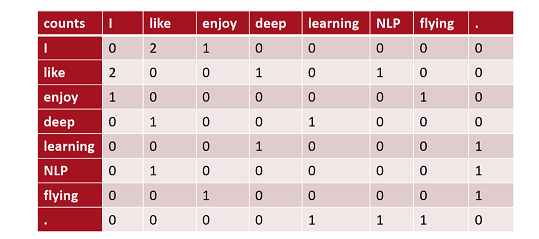
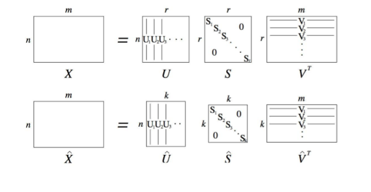
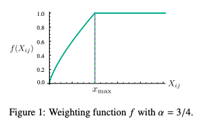

#### word2vec主要思想 


- 遍历语料库中的每个单词
- 通过词向量预测上下文单词
- 在每个窗口计算损失，根据SGD更新词向量
  
  
    **它会准确的给出在上下文中出现的单词的高概率估计；在上下文不会出现的单词，则得到低概率的估计**。
    
    **用一个简单的概率分布，来预测背景中所有的上下文单词的情况**


#### SGD
- $J(\theta)$是关于语料中所有窗口的函数，计算量十分大
- 解决方法：**随机梯度下降**
    - 对窗口进行采样
    - 基于采样窗口计算梯度更新参数
- 优点:
    - 减少噪声、减少过拟合
    - 计算快
- 缺点：
    - 每次更新只更新 矩阵中的少数列，计算的梯度非常稀疏


#### 负采样
- 词表 V 的量级非常大，以至于下式的分母很难计算：
  $$p(o|c)=\frac{exp(u_{o}^{T}v_{c})}{\sum_{w\subseteq V}exp(u_{w}^{T}v_{c})} $$

- 负采样机制：
    - 这是一种采样子集 简化运算的方法。
    - 具体做法是，对每个正例（中央词语及上下文中的一个词语） 采样几个负例（中央词语和其他随机词语），训练 binarylogisticregression（也 就是二分类器）。
    - 目标函数($\sigma$ 为sigmoid函数)：
    $$ J(\theta)= \frac{1}{T}\sum_{t=1}^{T} J_{t}(\theta) $$
    $$J_{t}(\theta) = log\sigma(U_{o}^{T}V_{c}) + \sum_{i=1}^{K}E_{j\sim P(w)}[log\sigma(-u_{j}^{T}v_{c})] $$
    
     - 算法：
       - 选取k个负样本(根据词出现的概率)
       - 最大化真实出现在窗口中的次的概率，最小化选取的负样本的概率
       $$ p(w)=U(w)^{3/4}/Z $$
           - 词出现频率分布的3/4次方
           - 3/4次方使得出现频率较低的次能**更频繁的被采样到**


####  共现矩阵
    word2vec 将窗口视作训练单位，每个窗口或者几个窗口都要进行一次参数更 新。要知道，很多词串出现的频次是很高的。能不能历一语料，迅速得到结 果呢？ 早在 word2vec 之前，就已经出现了很多得到词向量的方法，这些方法是基 于统计共现矩阵的方法。如果在窗口级别上统计词性和语义共现，可以得到相似 的词。如果在文档级别上统计，则会得到相似的文档（潜在语义分析 LSA）。
    
- 共现矩阵：

    栗子：窗口大小为1时(一般5-10)的共现矩阵如下图：
        I like deep learning.
        I like NLP。
        I enjoy flying.


- 简单使用共现矩阵的局限性：
    - 当出现新词的时候，以前的旧向量连维度都得改变
    - 高维度（词表大小）
    - 高稀疏性

    


#### 低维向量：奇异值分解
    解决共现矩阵高维问题
    但是如何降维？
- SVD:
    - 对任意矩阵可以分解为三个矩阵：$X= U \Sigma V^{T}$
    - $\Sigma$是一个对角矩阵，成为奇异向量； U,V是行和列的正交基
    - 如果需要减小维度，可以丢弃最小的奇异值。然后由R维降维到K维度。并保留了重要信息。
    

```python
'''
SVD分解
'''
import numpy as np
import matplotlib.pyplot as plt 
la = np.linalg
words =['I','like','enjoy','deep','learning','NLP','flying','.']
X=np.array([[0,2,1,0,0,0,0,0],
            [2,0,0,1,0,1,0,0],
            [1,0,0,0,0,0,1,0],
            [0,1,0,0,1,0,0,0],
            [0,0,0,1,0,0,0,0],
            [0,1,0,0,0,0,0,1],
            [0,0,1,0,0,0,0,1],
            [0,0,0,0,1,1,1,0],])
U,S,Vh = la.svd(X,full_matrices=False)
##for  i in range(len(words)):
##    plt.text(U[i,0],U[i,1],words[i])
```

    即使这么简单的三句话构建的语料，我们通过构建共现矩阵、进行SVD降维、可视化，依然呈现出了类似Word2Vec的效果。
    但是，由于共现矩阵巨大，SVD分解的计算代价也是很大的。另外，像a、the、is这种词，与其他词共现的次数太多，也会很影响效果。
- 改进：
    - 限制高频词的频次，或者干脆停用词
    - 根据与中央词的距离衰减词频权重
    - 用皮尔逊相关系数代替词频


####  基于共现矩阵的词向量 vs. Word2Vec词向量
    基于共现矩阵的词向量，也可以表现出很多优秀的性质，它也可以得到一个低维的向量表示，进行相似度的计算，甚至也可以做一定的推理（即存在man to king is like women to queen这样的关系）。 但是，它主要的问题在于两方面：

    SVD要分解一个巨型的稀疏矩阵（共现矩阵），计算开销大，甚至无法计算；
    需要进行复杂麻烦的预处理，例如计数的规范化、清除常见词、使用皮尔森系数等等。
    而「Word2Vec」的算法，「不需要一次性处理这么大量的数据」，而是通过「迭代」的方式，一批一批地进行处理，不断迭代词向量参数，使得我们可以处理海量的语料，构建十分稳健的词向量。所以在实验中，Word2Vec的表现，一般都要优于传统的SVD类方法。

    但是，「基于共现矩阵的方法也有其优势」，那就是「充分利用了全局的统计信息」。因为我们进行矩阵分解，是对整个共现矩阵进行分解，这个矩阵中包含着全局的信息。而Word2Vec由于是一个窗口一个窗口（或几个窗口）地进行参数的更新，所以学到的词向量更多的是局部的信息。


#### GloVe:于全局词频统计的词表征
#####  思路：
    - 首先建立一个很大的单词-上下文的共现矩阵，矩阵的每个元素 $X_{ij}$ 代表每个单词 $x_i$ 在相应上下文 $x_j$ 的环境中共同出现的次数。
    - 然后用共现次数计算出**共现比率**，并建立词向量与共现比率之间的映射关系，进而得到 GloVe 的模型函数。
    - 接着建立加权平方差损失函数，再用 AdaGrad 优化算法学习出词向量 $w$、$\tilde{w}$。


##### 共现率：
      “冰”和“水蒸气”它们的状态虽然不同，但是都可以形成水，所以可以猜想在“冰”和“水蒸气”的上下文中，和“水”有关的例如“潮湿”等词出现的概率是差不多的，而“冰冷”“固体”这样的词会在“冰”的上下文中出现得比较多，在“水蒸气”的上下文中就不怎么出现。实际结果如下表：
 
 
   - 从表中可以看到“水”、“固体”确实在“冰”的上下文中出现的概率比其他不相关的词要大，“水”、“气”在“水蒸气”的上下文中出现的概率比其他的要大。
   - 再看最后一行的比率，“水”与“冰”和“水蒸气”都相关，这个比值接近 1，“时尚”与“冰”和“水蒸汽”都不相关，这个比值也接近于 1。
   - 即对于 $word_i$、$word_j$、$word_k$，如果 $word_i$、$word_k$ 很相关，$word_j$、$word_k$ 不相关，那么 $\frac{P_{ik}}{P_{jk}}$ 比值会比较大，如果都相关，或者都不相关，那么这个比值应该趋于 1。由此可见上下文中两个单词之间的共现比率可以对含义相关的单词进行建模，因为我们可以通过这个比率看出单词 i 和 j 相对于 k 来讲哪个会更相关一些：
    - 如果都相关或者都不相关，则比率靠近 1；
    - 如果分子比分母更相关，则比率比 1 大很多；
    - 如果分母比分子更相关，则比率比 1 小很多。
- 根据共现率计算词向量：
    - 在上面我们提到了可以用共现比率来对含义相关的单词进行建模，那么希望用一个函数 F 来将三个词向量 $word_i$、$word_j$、$word_k$ 映射为这个比率，即：$$\begin{equation}F(w_i, w_j, \tilde{w_k}) = \frac{P_{ik}}{P_{jk}}\end{equation}$$
    - 其中 $P_{ik}=P(k|i)=X_{ik}/X_i$ 为在 $word_i$ 的上下文中 $word_k$ 的出现概率，$X_i$ 为单词 i 的上下文中所有单词的个数，$X_{ik}$ 为 $word_i$ 的上下文中 $word_k$ 的出现次数。
    - 这里 $w_i$、$w_j$ 为输入的词向量，$\widetilde{w_k}$ 为输出的词向量，相当于是 word2vec 中的上下文向量，因为在 GloVe 中上下文只有一个单词，所以 $\widetilde{w_k}$ 也是单个词向量。

#####  F 的具体形式：
- 希望它可以学习出带有含义的词向量，最好是运算越简单越好，例如简单的加减乘除。

- 于是想到用词向量的差来衡量单词之间的差异，将这个差距输入给 F，让 F 能捕捉到单词意义的不同，于是函数的输入就变成这个样子：$$\begin{equation}F(w_i - w_j, \tilde{w_k}) = \frac{P_{ik}}{P_{jk}}\end{equation}$$

- 为了在 $w_i - w_j$ 和 $\tilde{w_k}$ 之间建立一个线性关系，于是将二者的点积作为函数的输入，函数关系变为：
$$\begin{equation}F((w_i - w_j)^T \tilde{w_k}) = \frac{P_{ik}}{P_{jk}}\end{equation}$$

- 接下来想要 F 是同态的，即满足：
$$\begin{equation}F((w_i - w_j)^T \tilde{w_k}) = \frac{ F(w_i^T \tilde{w_k}) }{ F(w_j^T \tilde{w_k}) }\end{equation}$$

- 结合这两个式子可以得到：
$$\begin{equation}F(w_i^T \tilde{w_k}) = P_{ik} = \frac{X_{ik} }{ X_i }\end{equation}$$
- 从共现矩阵那里也可以看出，$word_i$、$word_j$ 的地位是同等的，所以经过 F 的作用，要满足它们的的顺序不影响结果，最好可以将右边的除法变成加减法，那就想到可以两边取 log，这样除法变成了减法，则 F 可以取为指数函数 exp，那么两边取对数，关系式变为：
$$\begin{equation}w_i^T \tilde{w_k} = log{P_{ik}} = log{X_{ik}} - log{X_{i}}\end{equation}$$
- 然后将 $log X_i$ 移到左边，因为和 $word_k$ 没有关系，所以可以归入到偏置 $bias_i$ 中，同时为了保持公式的对称性，再加入 $word_k$ 的 $bias_k$，于是得到：$$\begin{equation}w_i^T\tilde{w}_k + b_i + \tilde{b}_k = logX_{ik}\end{equation}$$
- **上式就是 GloVe 的核心等式，其中左边是词向量的运算，右边是共现矩阵的值。**

##### 损失函数：
- 有了上面的模型后，我们用平方差来衡量模型的损失：
$$\begin{equation}J = \sum_{i=1}^V \sum_{j=1}^V \; ( w_i^T\tilde{w}_j + b_i + \tilde{b}_j - logX_{ij} ) ^2\end{equation}$$

- 其中 V 是词汇表的大小。单纯用平方差作为损失函数存在一个问题，就是所有的共现情况都具有一样的权重，这样一些罕见的或者携带无用信息的共现会和携带更多信息的共现组合的地位平等，这其实是一种噪音，所以作者对损失函数进行加权，希望更多地关注共现多的词。于是损失函数变成：
$$\begin{equation}J = \sum_{i=1}^V \sum_{j=1}^V \; f(X_{ij}) ( w_i^T\tilde{w}_j + b_i + \tilde{b}_j - logX_{ij} ) ^2\end{equation}$$

- 为了让权重函数达到降噪的目的，它需要满足几个条件：
    - f(0) = 0；
    - f(x) 应该是非递减函数，这样稀有的共现就不会具有大的权重；
    - 对于较大的 x，f(x) 应该相对小一些，这样经常出现的共现就不会被赋予很大的权重，因为像“'it is”这种组合是经常共现的，但是却没有携带重要的信息，所以也不希望这样的情况权重过大。
- 通过实验，GloVe 的作者发现下面这个加权函数表现相对较好：
$$\begin{equation}f(X_{ij}) = \Biggl\{\begin{array}{lr}(X_{ij}/x_{max})^\alpha \quad if \; X_{ij} < x_{max}, & \\1 \quad otherwise\\\end{array}\end{equation}$$
它的图像是这样的：
- 作者还给出了两个超参数的参考值：$x_{max} = 100, \alpha=0.75$。可以看出开始时权重随 $X_{ij}$ 增加而逐渐增加，到 $x_{max}$ 之后为 1，整个函数值一直都不会大于 1。有了权重函数后我们就得到了最终的损失函数。

- 从 GloVe 的模型中，我们可以看出它会生成两个词向量 $w$、$\tilde{w}$，当 X 对称时， $w$、$\tilde{w}$ 也是对称的，因为随机初始化时的值不一样，最后得到的结果会不一样，不过这两个词向量其实是等价的，最后会选择 $w$ + $\tilde{w}$ 作为最终的词向量。

##### 总结：
- 目的：
    - 一个是利用全局的统计信息，而不仅仅是用局部信息，
    - 另一方面是想捕捉到词的含义，而且它在损失函数上还加了权重，为不同频率的共现组合予以不同的关注度。
- 优点：
    - 训练比较快。
    - 即使语料库较小时表现也不错，并且也能扩展到更大的语料库上，训练时改善较小就可以进行 early stopping。

```python

```
