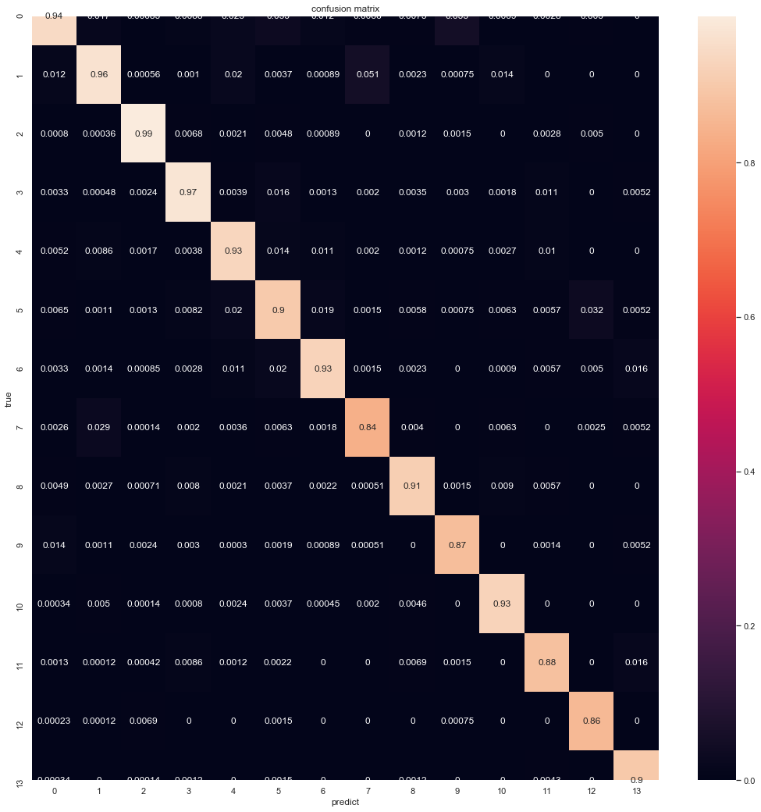

```python
import pandas as pd
import seaborn as sns
import matplotlib.pyplot as plt 
train_df = pd.read_csv('train_set.csv',sep='\t')
test_df  =  pd.read_csv('test_a.csv',sep='\t')

```

## 基于机器学习的文本分类

### 词表征

#### 1.TF-IDF 

- N-gram：将相邻单词组合成为**新的单词**，并进行计数。
- TF-IDF：TF-IDF 分数由两部分组成：第一部分是词语频率（Term Frequency），第二部分是逆文档频率（Inverse Document Frequency）。其中计算语料库中文档总数除以含有该词语的文档数量，然后再取对数就是逆文档频率。
    - TF(t)= 该词语在当前文档出现的次数 / 当前文档中词语的总数
    - IDF(t)= log_e（文档总数 / 出现该词语的文档总数）

#### 2.词袋

- 每个文档的字或词可以使用出现次数来进行表示。

#### 3. LDA主题模型 进行降维

- LDA用于将文档分类为特定主题。通过狄利克雷分布建模一个文档主题模型和一个单词主题模型。
- 它假设一个文档是由多个主题组成，这些主题通过他们的概率分布能够生成单词。
- 可以理解为LDA通过两层聚类、以主题连接文档和单词，一般用于无监督学习，也可以作为一种降维的方法。

### 结果

#### 1.得分情况

- 5万条训练数据+1万条测试数据作为语料  

- 训练时：将4.5W条作为训练集；0.5W作为验证集

  |                            | 维度 | 训练集f1分数 | 验证集f1分数 | 用时      |
  | -------------------------- | ---- | ------------ | ------------ | --------- |
  | BOW + RidgeClassifier      | 5000 | 0.676        | 0.686        | 13m 12s   |
  | BOW +  SVC                 | 5000 | 0.999        | 0.865        | 13m 56s   |
  | TFIDF + RidgeClassifier    | 5000 | 0.927        | 0.908        | 2m12s     |
  | TFIDF + SVC                | 5000 | 0.956        | 0.92         | 1h 9m 59s |
  | BOW +  LDA+RidgeClassifier | 300  | 0.741        | 0.764        | 446ms     |
  | BOW + LDA+SVC              | 300  | 0.775        | 0.778        | 3m 52s    |

- TFIDF表征加SVC 的训练集和验证集得分都是最好的，但是存在一定过拟合。而且训练时间很长。可以尝试下归一化。
- LDA 的结果不是很理想，但是速度非常快。进行调参，比如增加主题数，应该还有上升空间。
- 词袋表征加SVC训练时间比TFIDF短很多。过拟合情况严重。 
- **以上都是初步结果，没有进行调参。**调参后，应该还有很大上升空间。由于比较耗时，暂时不做了。

#### 2. 类别分类情况

TFIDF+RidgeClassifier ：稍微有点偏向样本多的情况；7-13的正确率基本都在0.9以下。但是没有过度偏倚。



### 代码


```python
import pandas as pd
from sklearn.feature_extraction.text import TfidfVectorizer
from sklearn.feature_extraction.text import CountVectorizer
from sklearn.linear_model import RidgeClassifier
from sklearn.metrics import f1_score
from sklearn.svm import SVC
```


```python
text_all = pd.concat([
   	 train_df[['text','text_nostopwords']][:50000],
     test_df[['text','text_nostopwords']][:10000]
])
```


```python
'''
tf_idf 词表征
'''
def tf_idf(n_gram=(1,3),df=None,max_feature=5000,is_sp=1):
    tfidf = TfidfVectorizer(ngram_range=n_gram, max_features=max_feature)
    if is_sp:
        return  tfidf.fit_transform(df['text_nostopwords'])  
    else:
        return  tfidf.fit_transform(df['text']) 
   
```


```python
tfidf_3gram_all_isp = tf_idf(df=text_all,is_sp=1)
tfidf_3gram_train_isp=tfidf_3gram_all_isp[:50000]
tfidf_3gram_test_isp=tfidf_3gram_all_isp[50000:]
```


```python
def model_train(model,trainx):
    m = trainx.shape[0]
    t= int(m*0.9)
    if model=='RidgeClassifier':
        clf = RidgeClassifier()
    if model=='SVC':
        clf = SVC(kernel='linear')
    print('**开始训练**')
    clf.fit(trainx[:t], train_df['label'].values[:t])
    print('**训练完毕**')
    val_pred = clf.predict(trainx[t:m])
    print('model {}的分数为:'.format(model),f1_score(train_df['label'].values[t:m], val_pred, average='macro'))
    return clf
        
    
```

**3_gram +去停用词+RidgeClassifier**


```python
model1 = model_train('RidgeClassifier',tfidf_3gram_train_isp)
```

    **开始训练**
    **训练完毕**
    model RidgeClassifier的分数为: 0.9080339623801398

```python
val_pred = model1.predict(tfidf_3gram_train_isp[:45000])
print('RidgeClassifier的训练分数为:'.format(model1),f1_score(train_df['label'].values[:45000], val_pred, average='macro'))
```

    RidgeClassifier的训练分数为: 0.9272558683190872

**3_gram +去停用词+SVC**


```python
model3 = model_train('SVC',tfidf_3gram_train_isp)
```

    **开始训练**
    **训练完毕**
    model SVC的分数为: 0.9197609814476576

```python
val_pred = model3.predict(tfidf_3gram_train_isp[:45000])
print('SVC的训练分数为:',f1_score(train_df['label'].values[:45000], val_pred, average='macro'))
```

    SVC的训练分数为: 0.9559420771010563

**3_gram +去停用词+SVC+最大特征4000**

2_gram、4_gram不如3_gram效果好
最大特征3000、4000不如5000好

**前面tfidf效果还不错，所以也尝试下词袋模型**


```python
'''
BOW 词表征
'''
def bow(df=None,max_feature=5000,is_sp=1):
    bow = CountVectorizer( max_features=max_feature)
    if is_sp:
        return  bow.fit_transform(df['text_nostopwords'])  
    else:
        return  bow.fit_transform(df['text']) 
```


```python
bow_3gram_all_isp = bow(df=text_all,is_sp=1)
bow_3gram_train_isp=bow_3gram_all_isp[:50000]
bow_3gram_test_isp=bow_3gram_all_isp[50000:]
```

##### 词袋模型+RidgeClassifier


```python
model3 = model_train('RidgeClassifier',bow_3gram_train_isp)
```

    **开始训练**
    **训练完毕**
    model RidgeClassifier的分数为: 0.686134792837908

```python
val_pred = model3.predict(bow_3gram_train_isp[:45000])
print('RidgeClassifier的训练分数为:',f1_score(train_df['label'].values[:45000], val_pred, average='macro'))
```

    RidgeClassifier的训练分数为: 0.6766254521656477


##### 词袋模型+SVC


```python
model8 = model_train('SVC',bow_3gram_train_isp)
```

    **开始训练**
    **训练完毕**
    model SVC的分数为: 0.8659433926557848

```python
val_pred = model8.predict(bow_3gram_train_isp[:45000])
print('RidgeClassifier的训练分数为:',f1_score(train_df['label'].values[:45000], val_pred, average='macro'))
```

```
RidgeClassifier的训练分数为: 0.999963010738479
```

**LDA的主题词特征提取**

**基于词袋的LDA**


```python
import nltk
from gensim import corpora, models, similarities

corpus = [] 
for text in text_all['text_nostopwords']:
    corpus.append(text.split(' '))
dictionary = corpora.Dictionary(corpus)
bow_corpus = [dictionary.doc2bow(doc) for doc in corpus[:50000]]
```


```python
lda_model_bow = models.LdaMulticore(bow_corpus, 
                                       num_topics=300, 
                                       id2word = dictionary, 
                                       passes = 2, 
                                       workers=10)
```


```python
lda_model_bow[bow_corpus[0]]
```


    [(6, 0.080329426),
     (42, 0.011841541),
     (57, 0.3039856),
     (76, 0.05372371),
     (210, 0.42490965),
     (222, 0.021933237),
     (228, 0.102352895)]


```python
import numpy as np 
bow_train_lda = np.zeros((len(bow_corpus),300)) 

for i in range(len(bow_corpus)):
    tmp = lda_model_bow[bow_corpus[i]]
    for idx,v in tmp:
        bow_train_lda[i][idx]=v 
```

**基于TF-IDF的LDA**


```python
tfidf = models.TfidfModel(bow_corpus)
corpus_tfidf = tfidf[bow_corpus]

lda_model_tfidf = models.LdaMulticore(corpus_tfidf, 
                                             num_topics=300, 
                                             id2word = dictionary, 
                                             passes = 2, 
                                             workers=10)
```


```python
lda_model_tfidf[corpus_tfidf[2]]
```


    [(213, 0.30070838), (229, 0.442947)]


```python
tfidf_train_lda= np.zeros((len(bow_corpus),300)) 
```


```python
for i in range(len(bow_corpus)):
    tmp = lda_model_tfidf[corpus_tfidf[i]]
    for idx,v in tmp:
        tfidf_train_lda[i][idx]=v 
```

**词袋 LDA+RidgeClassifier**


```python
model4 = model_train('RidgeClassifier',bow_train_lda)
```

    **开始训练**
    **训练完毕**
    model RidgeClassifier的分数为: 0.7643469650133333

```python
val_pred = model4.predict(bow_train_lda[:45000])
print('SVC的训练分数为:',f1_score(train_df['label'].values[:45000], val_pred, average='macro'))
```

    SVC的训练分数为: 0.7410195854725045

**词袋 LDA+SVC**


```python
model5 = model_train('SVC',bow_train_lda)
```

    **开始训练**
    **训练完毕**
    model SVC的分数为: 0.7784937225213907

```python
val_pred = model5.predict(bow_train_lda[:45000])
print('SVC的训练分数为:',f1_score(train_df['label'].values[:45000], val_pred, average='macro'))
```

    SVC的训练分数为: 0.775517932330982


