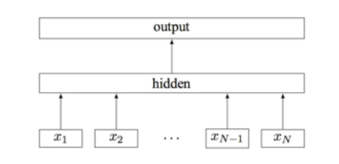
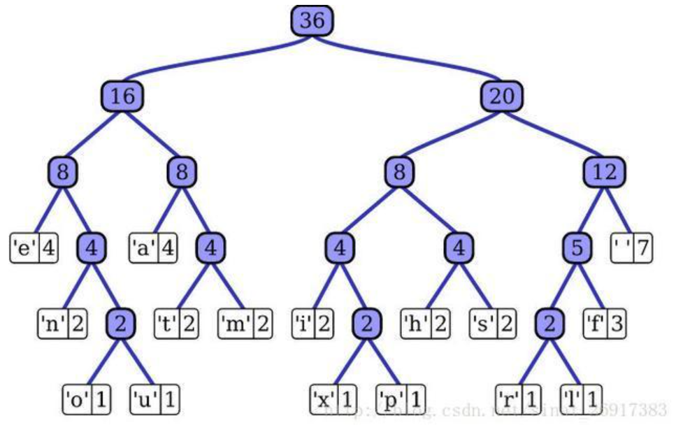
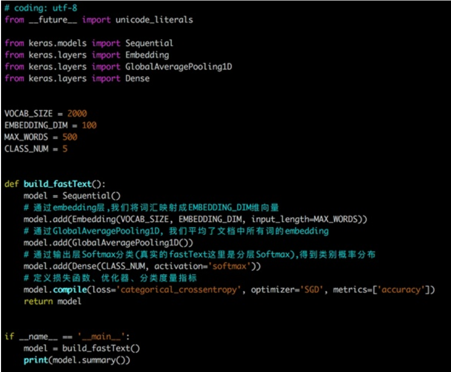

## 基于深度学习的文本分类

与传统机器学习不同，深度学习既提供特征提取功能，也可以完成分类的功能


### 1. 现有文本表示方法的缺陷

- one-hot :转换得到的向量维度很高，需要较长的训练实践；
- Bag of Words、N-gram、TF-IDF：没有考虑单词与单词之间的关系，只是进行了统计。
- 与这些表示方法不同，深度学习也可以用于文本表示，还可以将其映射到一个低纬空间。其中比较典型的例子有：FastText、Word2Vec和Bert。

### FastText

#### 1. FastText的使用和基础原理

- fastText方法包含三部分，模型架构，层次SoftMax和N-gram特征。

##### 1.架构
- FastText是一种典型的深度学习词向量的表示方法，它非常简单通过Embedding层将单词映射到稠密空间，然后将句子中所有的单词在Embedding空间中进行平均，进而完成分类操作。

- FastText是一个三层的神经网络，输入层、隐含层和输出层。

- 其中x1,x2,…,xN−1,xN表示一个文本中的n-gram向量，每个特征是词向量的平均值。



- fastText 模型输入一个词的序列（一段文本或者一句话)，输出这个词序列属于不同类别的概率。
- 序列中的词和词组组成特征向量，特征向量通过线性变换映射到中间层，中间层再映射到标签。
- fastText 在预测标签时使用了非线性激活函数，但在中间层不使用非线性激活函数。fastText 模型架构和 Word2Vec 中的 CBOW 模型很类似。不同之处在于，fastText 预测标签，而 CBOW 模型预测中间词。

##### 2.层次SoftMax
- 标准的Softmax回归中，要计算y=j时的Softmax概率：，我们需要对所有的K个概率做归一化，这在|y|很大时非常耗时。于是，分层Softmax诞生了，它的基本思想是使用树的层级结构替代扁平化的标准Softmax，使得在计算时，只需计算一条路径上的所有节点的概率值，无需在意其它的节点。

- fastText 也利用了类别（class）不均衡这个事实（一些类别出现次数比其他的更多），通过使用 Huffman 算法建立用于表征类别的树形结构。因此，频繁出现类别的树形结构的深度要比不频繁出现类别的树形结构的深度要小，这也使得进一步的计算效率更高。

- Huffman树：给定N个权值作为N个叶子结点，构造一棵二叉树，若该树的带权路径长度达到最小，称这样的二叉树为最优二叉树，也称为哈夫曼树(Huffman Tree)。哈夫曼树是带权路径长度最短的树，权值较大的结点离根较近。
- Huffman树的构造：https://blog.csdn.net/qq_29519041/article/details/81428934



- 和CBOW一样，fastText模型也只有三层：输入层、隐含层、输出层（Hierarchical Softmax），输入都是多个经向量表示的单词，输出都是一个特定的target，隐含层都是对多个词向量的叠加平均。
- 不同的是，CBOW的输入是目标单词的上下文，fastText的输入是多个单词及其n-gram特征，这些特征用来表示单个文档；CBOW的输入单词被onehot编码过，fastText的输入特征是被embedding过；CBOW的输出是目标词汇，fastText的输出是文档对应的类标。

- 细节：https://blog.csdn.net/itplus/article/details/37969979
##### 3.N-gram特征
- fastText 可以用于文本分类和句子分类。不管是文本分类还是句子分类，我们常用的特征是词袋模型。但词袋模型不能考虑词之间的顺序，因此 fastText 还加入了 N-gram 特征。为了提高效率，我们需要过滤掉低频的 N-gram。


##### 4. 总结
- fastText是一个快速文本分类算法，与基于神经网络的分类算法相比有两大优点：
    - 1、fastText在保持高精度的情况下加快了训练速度和测试速度
    - 2、fastText不需要预训练好的词向量，fastText会自己训练词向量
    - 3、fastText两个重要的优化：Hierarchical Softmax、N-gram

##### 5. 使用keras实现的FastText网络结构：




#### 2.  代码

##### 初步调参
- **调参后发现，都出现了过拟合现象，当 wordNgrams =1时不是很严重，但它的训练集验证集效果都不好**
- **当 wordNgrams>=3,学习率>=0.3时，训练集得分都达到了0.99以上；测试集得分也不错。但是同时过拟合现象开始严重**


| 训练集得分 | wordNgrams |        |        |        |        |
| ---------- | ---------- | ------ | ------ | ------ | ------ |
| 学习率     | 1          | 2      | 3      | 4      | avg    |
| 0.05       | 0.8837     | 0.9271 | 0.9109 | 0.8924 | 0.9035 |
| 0.1        | 0.8943     | 0.9588 | 0.9587 | 0.9509 | 0.9407 |
| 0.3        | 0.8997     | 0.9885 | 0.9927 | 0.9919 | 0.9682 |
| 0.5        | 0.9018     | 0.9938 | 0.9977 | 0.9974 | 0.9727 |
| 0.7        | 0.9017     | 0.9953 | 0.9988 | 0.9989 | 0.9737 |
| avg        | 0.8962     | 0.9727 | 0.9717 | 0.9663 |        |


| 验证集得分 | wordNgrams |        |        |        |        |
| ---------- | ---------- | ------ | ------ | ------ | ------ |
| 学习率     | 1          | 2      | 3      | 4      | avg    |
| 0.05       | 0.8657     | 0.8992 | 0.8937 | 0.8671 | 0.8814 |
| 0.1        | 0.8807     | 0.9130 | 0.9171 | 0.9082 | 0.9048 |
| 0.3        | 0.8694     | 0.9163 | 0.9216 | 0.9184 | 0.9064 |
| 0.5        | 0.8699     | 0.9235 | 0.9189 | 0.9170 | 0.9073 |
| 0.7        | 0.8676     | 0.9135 | 0.9248 | 0.9174 | 0.9058 |
| avg        | 0.8707     | 0.9131 | 0.9152 | 0.9056 |        |

| 可调整方差 | wordNgrams |        |        |        |        |
| ---------- | ---------- | ------ | ------ | ------ | ------ |
| 学习率     | 1          | 2      | 3      | 4      |        |
| 0.05       | 0.0181     | 0.0279 | 0.0172 | 0.0253 | 0.0221 |
| 0.1        | 0.0136     | 0.0458 | 0.0416 | 0.0427 | 0.0359 |
| 0.3        | 0.0303     | 0.0722 | 0.0711 | 0.0735 | 0.0618 |
| 0.5        | 0.0319     | 0.0704 | 0.0788 | 0.0804 | 0.0654 |
| 0.7        | 0.0341     | 0.0819 | 0.0740 | 0.0815 | 0.0679 |
| avg        | 0.0256     | 0.0596 | 0.0565 | 0.0607 |        |


```python
import gc 
import fasttext
import pandas as pd
from sklearn.metrics import f1_score

# 转换为FastText需要的格式
train_df = pd.read_csv('train_set.csv', nrows=200000)
train_df['label_ft'] = '__label__' + train_df['label'].astype(str)
## 将数据分成20块
train_df=train_df.reset_index(drop=False)
train_df['chunk']=train_df['index'].apply(lambda x:x//10000)
del train_df['index']
```


```python
a = 0
for i in [0.05,0.1,0.3,0.5,0.7]:
    for j in [1,2,3,4]:
        train_df[train_df.chunk!=a][['text_nostopwords','label_ft']].to_csv('train{}.csv'.format(a), index=None, header=None, sep='\t')
        gc.collect()
        model = fasttext.train_supervised('train{}.csv'.format(a), lr=i, wordNgrams=j, verbose=1, minCount=2, epoch=20, loss="hs")
        gc.collect()
        val_pred = [model.predict(x)[0][0].split('__')[-1] for x in train_df[train_df.chunk==a]['text_nostopwords']]
        print('第{}轮验证集得分：'.format(a),f1_score(train_df[train_df.chunk==a]['label'].values.astype(str), val_pred, average='macro'))
        model.save_model("model_{}.bin".format(a))
        gc.collect()
        a+=1
```

    第0轮验证集得分： 0.8656537915456466
    第1轮验证集得分： 0.8992325884008228
    第2轮验证集得分： 0.8936774998581996
    第3轮验证集得分： 0.867112682743608
    第4轮验证集得分： 0.8807203365230276
    第5轮验证集得分： 0.913009034074127
    第6轮验证集得分： 0.9170905990064914
    第7轮验证集得分： 0.9082022953710883
    第8轮验证集得分： 0.8694391418629911
    第9轮验证集得分： 0.9163202602150945
    第10轮验证集得分： 0.9215890420148881
    第11轮验证集得分： 0.9183973157929071
    第12轮验证集得分： 0.8699130448049852
    第13轮验证集得分： 0.9234506098836724
    第14轮验证集得分： 0.9189158914219596
    第15轮验证集得分： 0.9169980520220228
    第16轮验证集得分： 0.8676112908612829
    第17轮验证集得分： 0.9134748238130381
    第18轮验证集得分： 0.9247903376585985
    第19轮验证集得分： 0.9174080596528963


```python
for a in range(20):
    model = fasttext.load_model("model_{}.bin".format(a))
    gc.collect()
    val_pred = [model.predict(x)[0][0].split('__')[-1] for x in train_df[train_df.chunk!=a]['text_nostopwords']]
    gc.collect()
    print('第{}轮训练集得分：'.format(a),f1_score(train_df[train_df.chunk!=a]['label'].values.astype(str), val_pred, average='macro'))
    gc.collect()
```


    第0轮训练集得分： 0.8837432138750335


    第1轮训练集得分： 0.927100105826785


    第2轮训练集得分： 0.9109043011365658


    Warning : `load_model` does not return WordVectorModel or SupervisedModel any more, but a `FastText` object which is very similar.


    第3轮训练集得分： 0.8924206103861121


    Warning : `load_model` does not return WordVectorModel or SupervisedModel any more, but a `FastText` object which is very similar.


    第4轮训练集得分： 0.894270805114278


    Warning : `load_model` does not return WordVectorModel or SupervisedModel any more, but a `FastText` object which is very similar.


    第5轮训练集得分： 0.9587675784527585


    Warning : `load_model` does not return WordVectorModel or SupervisedModel any more, but a `FastText` object which is very similar.


    第6轮训练集得分： 0.9587019995029343


    Warning : `load_model` does not return WordVectorModel or SupervisedModel any more, but a `FastText` object which is very similar.


    第7轮训练集得分： 0.9508820278087929


    Warning : `load_model` does not return WordVectorModel or SupervisedModel any more, but a `FastText` object which is very similar.


    第8轮训练集得分： 0.8997286284575502


    Warning : `load_model` does not return WordVectorModel or SupervisedModel any more, but a `FastText` object which is very similar.


    第9轮训练集得分： 0.9884970708321273


    Warning : `load_model` does not return WordVectorModel or SupervisedModel any more, but a `FastText` object which is very similar.


    第10轮训练集得分： 0.9926521386301443


    Warning : `load_model` does not return WordVectorModel or SupervisedModel any more, but a `FastText` object which is very similar.


    第11轮训练集得分： 0.991931862138553


    Warning : `load_model` does not return WordVectorModel or SupervisedModel any more, but a `FastText` object which is very similar.


    第12轮训练集得分： 0.901783011058655


    Warning : `load_model` does not return WordVectorModel or SupervisedModel any more, but a `FastText` object which is very similar.


    第13轮训练集得分： 0.9938324287935261


    Warning : `load_model` does not return WordVectorModel or SupervisedModel any more, but a `FastText` object which is very similar.


    第14轮训练集得分： 0.9977019673385893


    Warning : `load_model` does not return WordVectorModel or SupervisedModel any more, but a `FastText` object which is very similar.


    第15轮训练集得分： 0.9974177326674135


    Warning : `load_model` does not return WordVectorModel or SupervisedModel any more, but a `FastText` object which is very similar.


    第16轮训练集得分： 0.9016987044201216


    Warning : `load_model` does not return WordVectorModel or SupervisedModel any more, but a `FastText` object which is very similar.


    第17轮训练集得分： 0.995328080680666


    Warning : `load_model` does not return WordVectorModel or SupervisedModel any more, but a `FastText` object which is very similar.


    第18轮训练集得分： 0.9987557418715028


    Warning : `load_model` does not return WordVectorModel or SupervisedModel any more, but a `FastText` object which is very similar.


    第19轮训练集得分： 0.9989166579571224


##### 提交测试集结果

测试集提交结果到线上得分**0.9220**，fasttext真的是效果好，速度快。


**与验证集0.9248差距不大**，但都与训练集差距较大。

所以**测试集a与训练集是同分布的**，但是模型过拟合。

基于机器学习没有办法提交，我的CPU上跑不出25W语料的TFIDF。但是验证集上最高分数也有0.92，并且可减少方差才0.03 (fasttext0.07左右).如果有办法在整个语料上训练，应该也能得到不错的分数。

接下来，减小方差和过拟合


```python
model = fasttext.load_model("model_18.bin")
test_df = pd.read_csv('test_a.csv')
val_pred = [model.predict(x)[0][0].split('__')[-1] for x in test_df['text_nostopwords']]
test_df['label'] = val_pred 
sub_ft=pd.read_csv('test_a_sample_submit.csv')
sub_ft['label']=val_pred 
sub_ft.to_csv('sub_ft2.csv')
#score:0.9220 ,lr=0.7,wordNgrams=3时，epoch=20,minCount=2,训练集19万，验证集1万.
```

    Warning : `load_model` does not return WordVectorModel or SupervisedModel any more, but a `FastText` object which is very similar.


##### 提高验证集得分 与 减少过拟合

###### 1.减少epoch

**验证集分数在epoch10-15开始下降，我们将epoch定为10**


```python
a=0
for i in [3,5,7,10,15]:
    model = fasttext.train_supervised('train{}.csv'.format(a), lr=0.7, wordNgrams=3, verbose=1, minCount=1, epoch=i, loss="hs")
    gc.collect()
    val_pred = [model.predict(x)[0][0].split('__')[-1] for x in train_df[train_df.chunk!=a]['text_nostopwords']]
    gc.collect()
    print('epoch={}时训练集得分为：'.format(i),f1_score(train_df[train_df.chunk!=a]['label'].values.astype(str), val_pred, average='macro'))
    gc.collect()
    val_pred = [model.predict(x)[0][0].split('__')[-1] for x in train_df[train_df.chunk==a]['text_nostopwords']]
    print('epoch={}时测试集得分为：'.format(i),f1_score(train_df[train_df.chunk==a]['label'].values.astype(str), val_pred, average='macro'))
    gc.collect()
```

    epoch=3时得分为： 0.9476129335118566
    epoch=3时得分为： 0.9107175195818866
    epoch=5时得分为： 0.9689074686463456
    epoch=5时得分为： 0.9168046743546389
    epoch=7时得分为： 0.9812532667434307
    epoch=7时得分为： 0.9176546385174058
    epoch=10时得分为： 0.9909502268206117
    epoch=10时得分为： 0.9216717565982785
    epoch=15时得分为： 0.9969211064200393
    epoch=15时得分为： 0.9189921655430925


###### 2.尝试不同的损失函数

ova 的效果比hs提升了1.7个百分点，为**0.939**！！


```python
a=18
for i in ['ns',  'softmax', 'ova']:
    model = fasttext.train_supervised('train{}.csv'.format(a), lr=0.7, wordNgrams=3, verbose=1, minCount=1, epoch=10, loss=i)
    gc.collect()
    val_pred = [model.predict(x)[0][0].split('__')[-1] for x in train_df[train_df.chunk!=a]['text_nostopwords']]
    gc.collect()
    print('loss={}时训练集得分为：'.format(i),f1_score(train_df[train_df.chunk!=a]['label'].values.astype(str), val_pred, average='macro'))
    gc.collect()
    val_pred = [model.predict(x)[0][0].split('__')[-1] for x in train_df[train_df.chunk==a]['text_nostopwords']]
    print('loss={}时测试集得分为：'.format(i),f1_score(train_df[train_df.chunk==a]['label'].values.astype(str), val_pred, average='macro'))
    gc.collect()
```

    loss=ns时训练集得分为： 0.979892545297221
    loss=ns时测试集得分为： 0.9443190353147443
    loss=softmax时训练集得分为： 0.993114578847455
    loss=softmax时测试集得分为： 0.9381814728623147
    loss=ova时训练集得分为： 0.9921614289566858
    loss=ova时测试集得分为： 0.9471688050978214


```python
test_df = pd.read_csv('test_a.csv')
val_pred = [model.predict(x)[0][0].split('__')[-1] for x in test_df['text_nostopwords']]
test_df['label'] = val_pred 
sub_ft=pd.read_csv('test_a_sample_submit.csv')
sub_ft['label']=val_pred 
sub_ft.to_csv('sub_ft_ova.csv')
```

ns似乎还有提升的空间

epoch 为12时，验证集得分0.945。保存一下模型，明天提交下测试集。


```python

a=18
bst=0.0
for i in [10,11,12,13,14,15]:
    model = fasttext.train_supervised('train{}.csv'.format(a), lr=0.7, wordNgrams=3, verbose=1, minCount=1, epoch=i, loss='ns')
    gc.collect()
    val_pred = [model.predict(x)[0][0].split('__')[-1] for x in train_df[train_df.chunk!=a]['text_nostopwords']]
    gc.collect()
    print('epoch={}时训练集得分为：'.format(i),f1_score(train_df[train_df.chunk!=a]['label'].values.astype(str), val_pred, average='macro'))
    gc.collect()
    val_pred = [model.predict(x)[0][0].split('__')[-1] for x in train_df[train_df.chunk==a]['text_nostopwords']]
    val_score=f1_score(train_df[train_df.chunk==a]['label'].values.astype(str), val_pred, average='macro')
    if val_score>bst:
        bst=val_score
        ### 保存最好的模型
        model.save_model("ova_best_model.bin")
    print('epoch={}时测试集得分为：'.format(i),val_score)
    gc.collect()
    
```

    epoch=10时训练集得分为： 0.9801415979592009
    epoch=10时测试集得分为： 0.9433538361682494
    epoch=11时训练集得分为： 0.9827402810356057
    epoch=11时测试集得分为： 0.9450250600134605
    epoch=12时训练集得分为： 0.9850912116822854
    epoch=12时测试集得分为： 0.945213972310901
    epoch=13时训练集得分为： 0.9868940606388357
    epoch=13时测试集得分为： 0.9444955624004504
    epoch=14时训练集得分为： 0.9885691204452733
    epoch=14时测试集得分为： 0.9447401376090285
    epoch=15时训练集得分为： 0.9897843909788164
    epoch=15时测试集得分为： 0.9448126465492147


###### 3.文本数据增强

- 文本数据增强主要包含四种操作：同义词替换、随机插入、随机交换和随机删除。详细说明如下：
    - (1) 同义词替换(SR)：从句子中随机选择非停止词。用随机选择的同义词替换这些单词；
    - (2) 随机插入(RI)：随机的找出句中某个不属于停用词集的词，并求出其随机的同义词，将该同义词插入句子的一个随机位置。重复n次；
    - (3) 随机交换(Random Swap, RS)：随机的选择句中两个单词并交换它们的位置。重复n次；
    - (4) 随机删除(RD)：以概率p随机删除句子中每个单词。

- 由于数据加密，本次仅尝试方法3-4。


```python
test_df = pd.read_csv('test_a.csv')
X_all = pd.concat([train_df['text_nostopwords'],test_df['text_nostopwords']]).values
y_train = train_df['label'].values
```


```python
x_all = list(X_all)
y_all = list(y_train)+[0]*50000
```


```python
import re 
import numpy as np

def shuffle(d):
    return np.random.permutation(d)

def shuffle2(d):
    len_ = len(d)
    times = 2
    for i in range(times):
        index = np.random.choice(len_, 2)
        d[index[0]],d[index[1]] = d[index[1]],d[index[0]]
    return d

def dropout(d, p=0.2):
    len_ = len(d)
    index = np.random.choice(len_, int(len_ * p))
    for i in index:
        d[i] = ' '
    return d

def clean(xx):
    xx1= xx.split(' ')
    return xx1

def dataaugment(X):
    l = len(X)
    res=[]
    for i in range(l):
        item = clean(X[i])
        d1 = shuffle2(item)
        d11 = ' '.join(d1)
        d2 = dropout(item)
        d22 = ' '.join(d2)
        x = [' '.join(item),d11,d22][np.random.choice(3)] ##随机选择
        res.append(x)    
    return res
Xp_all= dataaugment(x_all)
gc.collect()
```


    0


```python
a=18
train_df['text_agu']=Xp_all[:200000]
test_df['text_agu']=Xp_all[200000:]
gc.collect()
train_df[train_df.chunk!=a][['text_agu','label_ft']].to_csv('train_agu.csv', index=None, header=None, sep='\t')
gc.collect()
```


    0


```python
model = fasttext.train_supervised('train_agu.csv', lr=0.7, wordNgrams=3, verbose=1, minCount=1, epoch=15, loss='ns')
gc.collect()
val_pred = [model.predict(x)[0][0].split('__')[-1] for x in train_df[train_df.chunk!=a]['text_agu']]
gc.collect()
print('agu 训练集得分为：',f1_score(train_df[train_df.chunk!=a]['label'].values.astype(str), val_pred, average='macro'))
gc.collect()
val_pred = [model.predict(x)[0][0].split('__')[-1] for x in train_df[train_df.chunk==a]['text_agu']]
val_score=f1_score(train_df[train_df.chunk==a]['label'].values.astype(str), val_pred, average='macro')
model.save_model("agu_ova_best_model.bin")
print('agu 测试集得分为：',val_score)
```
参考：https://blog.csdn.net/m0_37327467/article/details/95068860?ops_request_misc=%257B%2522request%255Fid%2522%253A%2522159558842619724839260453%2522%252C%2522scm%2522%253A%252220140713.130102334..%2522%257D&request_id=159558842619724839260453&biz_id=0&utm_medium=distribute.pc_search_result.none-task-blog-2~all~first_rank_ecpm_v3~pc_rank_v2-1-95068860.first_rank_ecpm_v3_pc_rank_v2&utm_term=Fasttext+%E8%B0%83%E5%8F%82&spm=1018.2118.3001.4187